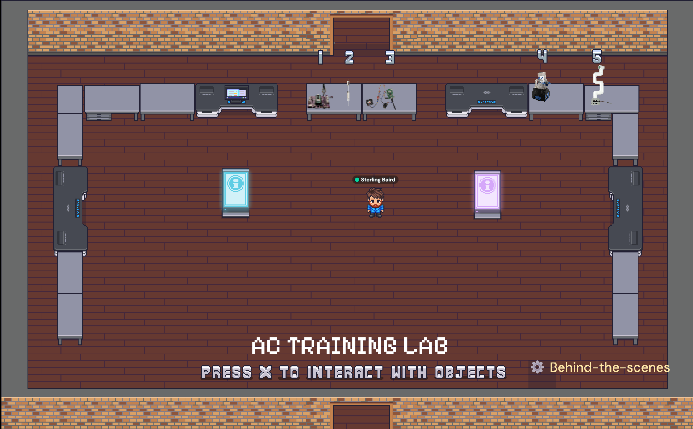
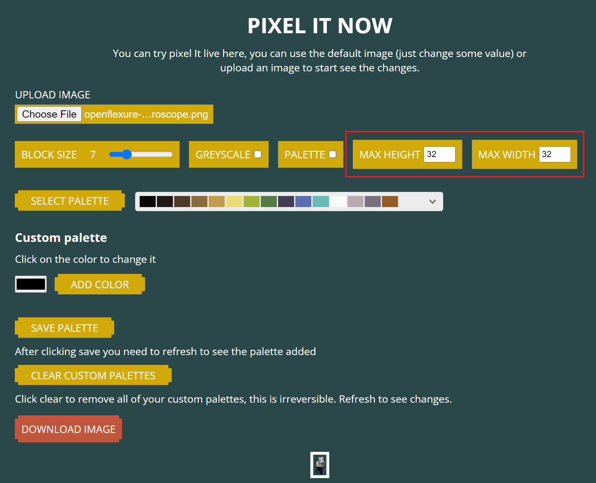

# Setting Up IoLT Devices

<!-- This document provides comprehensive instructions for setting up new IoLT devices, including documentation and demo for each device. Follow the steps below to ensure proper setup and configuration. -->

The AC Training Lab emphasizes not only repeatability, but also replicability. Solutions within the training lab should be chosen, designed, implemented, and documented with this in mind. In other words, if someone can take a look at something within the AC training lab and replicate it easily within their own lab with minimal frustration, the AC Training Lab is serving one of its most fundamental purposes. To achieve that, the following items are typically present when taking an Internet of Laboratory Things (IolT) device and demo from start to finish.

## GitHub Issues

Core tasks and sub-projects will be tracked using the [AC Training Lab GitHub issues](https://github.com/AccelerationConsortium/ac-training-lab/issues?q=sort%3Aupdated-desc+is%3Aissue+is%3Aopen). See for example [setting up the OT-2 liquid handler](https://github.com/AccelerationConsortium/ac-training-lab/issues/26) and [RS232 control of digital scale](https://github.com/AccelerationConsortium/ac-training-lab/issues/20). Many of these will also be surfaced to [the corresponding GitHub Project](https://github.com/orgs/AccelerationConsortium/projects/3?query=sort%3Aupdated-desc+is%3Aopen) (private) and any applicable [training lab milestones](https://github.com/AccelerationConsortium/ac-training-lab/milestone/1).

## Pull Requests

When you start writing some code for a device, create a new branch and open a draft pull request (PR) pointing to the training lab repo `main` branch. AC Training staff will have write access to anything other than the `main` branch, so if this applies to you, you can simply clone the repo and create a new branch. You're welcome to fork the repo if that's more straightforward for you. These PRs make it easier to have tight feedback cycles. See for example [mycobot 280 implementation](https://github.com/AccelerationConsortium/ac-training-lab/pull/52).

## MWE for functionality

Typically, these go into a `src/ac_training_lab/*/_scripts` folder. This also makes it easier to iteratively develop (start with basic functionality of the device, gradually work towards the full implementation with MQTT). You can check out some examples of `_scripts` folders for the [digital pipette](https://github.com/AccelerationConsortium/ac-training-lab/tree/main/src/ac_training_lab/picow/digital-pipette/_scripts), [fan control](https://github.com/AccelerationConsortium/ac-training-lab/tree/main/src/ac_training_lab/picow/fan-control/_scripts), and [magnetometer](https://github.com/AccelerationConsortium/ac-training-lab/tree/main/src/ac_training_lab/picow/magnetometer/_scripts) demos.

## Accelerated discovery post

This is used as a sort of "travel log" of work on the project. This one is more public facing, and easier for others to look at and contribute discussion to (easier than GitHub for those who are unfamiliar with GitHub). Check out [the examples](https://accelerated-discovery.org/tag/ac-training-lab). Periodic updates should be provided.

## MQTT orchestrator and device code

This enables hardware/software communication over WiFi. Typically, this will follow closely to https://ac-microcourses.readthedocs.io/en/latest/courses/hello-world/1.4-hardware-software-communication.html and the [companion notebook tutorial](https://ac-microcourses.readthedocs.io/en/latest/courses/hello-world/1.4.1-onboard-led-temp.html). See below for some examples (both orchestration and device code).

Orchestration
- [Light-mixing](https://huggingface.co/spaces/AccelerationConsortium/light-mixing/blob/main/app.py), [Digital Pipette](https://huggingface.co/spaces/AccelerationConsortium/digital-pipette/blob/main/app.py), [Fan control](https://huggingface.co/spaces/AccelerationConsortium/fan-control/blob/main/app.py)
- https://github.com/sparks-baird/self-driving-lab-demo/blob/main/src/self_driving_lab_demo/utils/observe.py
- https://github.com/AccelerationConsortium/ac-training-lab/blob/main/src/ac_training_lab/openflexure/microscope_demo_client.py

Device
- https://github.com/AccelerationConsortium/ac-training-lab/blob/main/src/ac_training_lab/picow/fan-control/main.py
- https://github.com/AccelerationConsortium/ac-training-lab/blob/main/src/ac_training_lab/picow/digital-pipette/main.py
- https://github.com/AccelerationConsortium/ac-training-lab/blob/main/src/ac_training_lab/picow/magnetometer/main.py

Please upload the device code to an appropriate directory (you may need to create a new one) within https://github.com/AccelerationConsortium/ac-training-lab/tree/main/src/ac_training_lab. For MicroPython implementations, please include a `main.py` that should be run by the user and any dependencies that are required in a `lib` subdirectory. For non-MicroPython implementations (e.g., Python), please include a `device.py` (meant to be run by user), `__init__.py`, and `requirements.txt` file. You can include other modules at the same level as `device.py` or in subdirectories of your choice (e.g., `utils`, don't use `lib` so that we can avoid confusion). Special instructions can go in a `README.md` file.

## MongoDB logging setup

Typically, anything with data and timestamp-based actions will be logged to a database. These implementations will usually follow closely to https://ac-microcourses.readthedocs.io/en/latest/courses/hello-world/1.5-data-logging.html and the companion notebook.

## Hugging Face Spaces

Each demo will typically have a streamlit app hosted on Hugging Face Spaces within [the Acceleration Consortium organization under a hardware control list](https://huggingface.co/collections/AccelerationConsortium/hardware-control-66a4506f9876e9781c8a0808).

Some additional context is available at https://ac-bo-hackathon.github.io/resources/ (scroll to bottom).

Watch [the two-minute video about hugging face spaces](https://youtu.be/3bSVKNKb_PY?si=3qAScm2xfjNy1vrN) [[docs](https://hf.co/docs/hub/spaces)]:

<iframe width="560" height="315" src="https://www.youtube.com/embed/3bSVKNKb_PY?si=WO0nd23jt3djERLj" title="YouTube video player" frameborder="0" allow="accelerometer; autoplay; clipboard-write; encrypted-media; gyroscope; picture-in-picture; web-share" referrerpolicy="strict-origin-when-cross-origin" allowfullscreen></iframe>

Likewise, watch a follow-up video about [contributing to a Hugging Face Spaces repository from within VS Code](https://youtu.be/OqqBk8_4gmQ):

<iframe width="560" height="315" src="https://www.youtube.com/embed/OqqBk8_4gmQ?si=qDA4oKt7XwFT8ktw" title="YouTube video player" frameborder="0" allow="accelerometer; autoplay; clipboard-write; encrypted-media; gyroscope; picture-in-picture; web-share" referrerpolicy="strict-origin-when-cross-origin" allowfullscreen></iframe>

Next, explore the code (see "files" tab) in the AC's various hardware control apps: https://huggingface.co/collections/AccelerationConsortium/hardware-control-66a4506f9876e9781c8a0808. New web apps will live next to these in the same list.

In particular, the [light-mixing app](https://huggingface.co/spaces/AccelerationConsortium/light-mixing/blob/main/app.py) is an example of sending a command and receiving a single set of sensor data. The [Digital Pipette app](https://huggingface.co/spaces/AccelerationConsortium/digital-pipette/blob/main/app.py) is an example of sending a command without feedback or a response. The [fan control app](https://huggingface.co/spaces/AccelerationConsortium/fan-control) is an example of sending a command and receiving a continuous flow of data back.

In general, you should cache the MQTT client to avoid creating a new connection every time a button is clicked.

```python
# Singleton: https://docs.streamlit.io/develop/api-reference/caching-and-state/st.cache_resource
@st.cache_resource
def create_paho_client(tls=True):
    client = mqtt.Client(protocol=mqtt.MQTTv5)
    if tls:
        client.tls_set(tls_version=mqtt.ssl.PROTOCOL_TLS_CLIENT)
    return client
```

Paho MQTT is the preferred MQTT package. Generally, you won't need threading or asynchrony, and these don't work well with the Streamlit package anyway, which is primarily designed for synchronous code.

The AC Training Lab apps typically have public test credentials given, but depending on the hardware and broker being used (e.g., the AC's HiveMQ Starter Plan broker to allow for temporary access control), the credentials should be accessed via [Hugging Face Spaces secrets](https://discuss.huggingface.co/t/how-to-manage-user-secrets-and-api-keys/67948/4).

## Video demo

Some examples:
- https://youtube.com/shorts/jQLtg0luPNc?feature=share
- https://youtube.com/shorts/rVnvR2fWg2Y?feature=share
- https://accelerated-discovery.org/t/building-the-high-resolution-motorized-openflexure-microscope-v7-using-the-rodeostat-kit/231/16?u=sgbaird

## Video setup tutorial

Examples:
- https://youtu.be/U_jJQKIOzTg
- https://youtu.be/meaXhH14zzY
- https://youtube.com/shorts/_3stUKidY7Y?feature=share

## Docs page and tutorial (BoM, setup, etc.)

To be added as [a device page](https://github.com/AccelerationConsortium/ac-training-lab/tree/main/docs/devices). More examples to follow.

Examples:
- https://ac-microcourses.readthedocs.io/en/latest/courses/robotics/3.1-pumps-and-pipettes.html
- https://ac-microcourses.readthedocs.io/en/latest/courses/robotics/3.2-serial-communication.html

## Embedding into Gather Town

The AC Training Lab has recently become virtual 😎. After running the [Bayesian optimization hackathon](https://ac-bo-hackathon.github.io/) in March 2024 using https://www.gather.town/, I decided I would give it a try for the AC Training Lab. The devices have embedded Streamlit web apps hosted on Hugging Face Spaces (see below). The physical hardware shown here are typically set up in Toronto, ON, with plans to add interfaces to communicate with hardware in other locations.



You can check the space out yourself by clicking on the invite link below. If you find something not working or have a suggestion, please feel free to [open an issue](https://github.com/AccelerationConsortium/ac-training-lab/issues/new).

Invite link: https://app.gather.town/invite?token=Ob0RdnDDQ2u0IbA1r674

Password: `japanese-envelope-spoken` (subject to change in case access needs to be refreshed for some reason)

<iframe width="560" height="315" src="https://www.youtube.com/embed/DIYvp_6L4kY?si=lKFYES5GAIW7_fuB" title="YouTube video player" frameborder="0" allow="accelerometer; autoplay; clipboard-write; encrypted-media; gyroscope; picture-in-picture; web-share" referrerpolicy="strict-origin-when-cross-origin" allowfullscreen></iframe>

You can add create sprites for new Gather Town "devices" using the following steps:
1. Snap a picture of or find an online image of the physical hardware and save to https://github.com/AccelerationConsortium/ac-training-lab/tree/main/reports/figures/gather-town
1. Use the Adobe Express background remover on the image and save to https://github.com/AccelerationConsortium/ac-training-lab/tree/main/reports/figures/gather-town with `-bg` appended to the filename (e.g., `mycobot-280.png` --> `mycobot-280-bg.png`).
2. Use https://giventofly.github.io/pixelit/#tryit to create the pixelated image (may need to play around with the settings)
    - Each block is 32 pixels<sup>2</sup>, and you can set the max width and max height settings as needed (see below)
    - For larger devices or devices with more detail that you want to expose, you can take up multiple "blocks" within Gather Town
    - Try not to take up more than a 2x2 grid



See the [Gather Town instructions](https://support.gather.town/hc/en-us/articles/15909788073236-Custom-Objects) for adding custom objects.

Finally, enter a short name for the device in "Prompt Message" under advanced settings for the object. This is what users will see pop up when they go nearby the device.


