# 🏢 AC Training Lab

```{note}
If you would like to participate or are interested in contributing, please [introduce yourself](https://github.com/AccelerationConsortium/ac-training-lab/discussions/2) or reach out to sterling.baird@utoronto.ca.
```

The [Acceleration Consortium](https://github.com/AccelerationConsortium) (AC)
Training Lab is a remotely accessible facility that houses a
diverse set of physical hardware for self-driving laboratories (SDLs) including
liquid handlers, solid dispensers, Cartesian-axis systems, mobile robotic arms,
and synthesis and characterization modules. Where possible, both educational and
research-grade hardware are included. The AC Training Lab is used to
develop and test SDLs and to provide a platform for training students and
researchers in the use of SDLs. The [AC Training Lab GitHub repository](https://github.com/AccelerationConsortium/ac-training-lab) also acts as an example of
setting up an autonomous laboratory.

<a class="github-button" href="https://github.com/AccelerationConsortium/ac-training-lab"
data-icon="octicon-star" data-size="large" data-show-count="true" aria-label="Star
AccelerationConsortium/ac-training-lab on GitHub">Star</a>
<a class="github-button"
href="https://github.com/AccelerationConsortium" data-size="large" data-show-count="true"
aria-label="Follow @AccelerationConsortium on GitHub">Follow @AccelerationConsortium</a>
<a class="github-button"
href="https://github.com/sgbaird" data-size="large" data-show-count="true"
aria-label="Follow @sgbaird on GitHub">Follow @sgbaird</a>
<a class="github-button" href="https://github.com/AccelerationConsortium/ac-training-lab/issues"
data-icon="octicon-issue-opened" data-size="large" data-show-count="true"
aria-label="Issue AccelerationConsortium/ac-training-lab on GitHub">Issue</a>
<a class="github-button" href="https://github.com/AccelerationConsortium/ac-training-lab/discussions" data-icon="octicon-comment-discussion" data-size="large" aria-label="Discuss AccelerationConsortium/ac-training-lab on GitHub">Discuss</a>

The equipment in the training lab can be broadly categorized in the following
categories: characterization, prototyping, synthesis, dispensing, environment,
and infrastructure. See the image below for an example of some of the equipment
intended for the AC Training Lab.

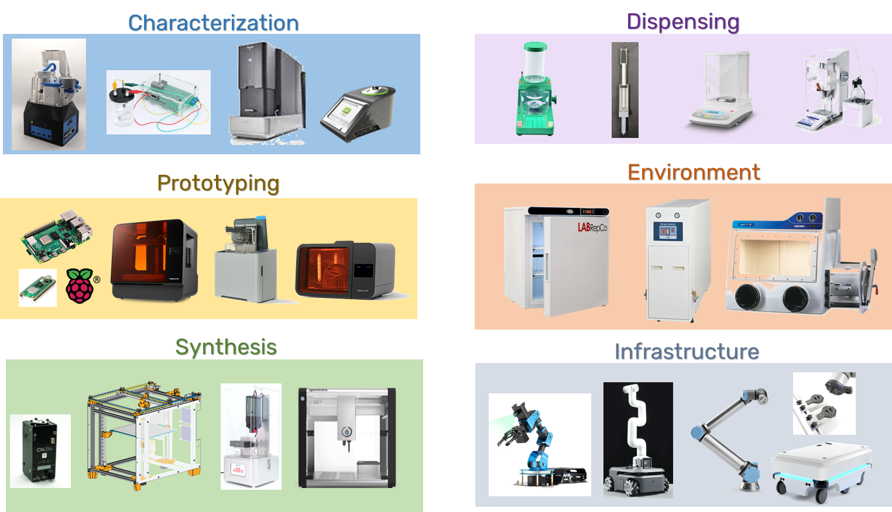

Here are some of the modules we have procured and are in the process of setting up (help wanted if you're in Toronto!):

<!-- TODO: Convert this to YAML and autopopulate table, preferably linked to current status somehow (planning, in progress, complete, etc.) -->

| Name                                                                                                                                                                                                                                                                          | Image                                                                | Qty   | Description                                                                                                                                                                                                                                     | Video                                                                                                                                     |
| ----------------------------------------------------------------------------------------------------------------------------------------------------------------------------------------------------------------------------------------------------------------------------- | -------------------------------------------------------------------- | ----- | ----------------------------------------------------------------------------------------------------------------------------------------------------------------------------------------------------------------------------------------------- | ----------------------------------------------------------------------------------------------------------------------------------------- |
| [Science Jubilee](https://science-jubilee.readthedocs.io/)                                                                                                                                                                                                                    | 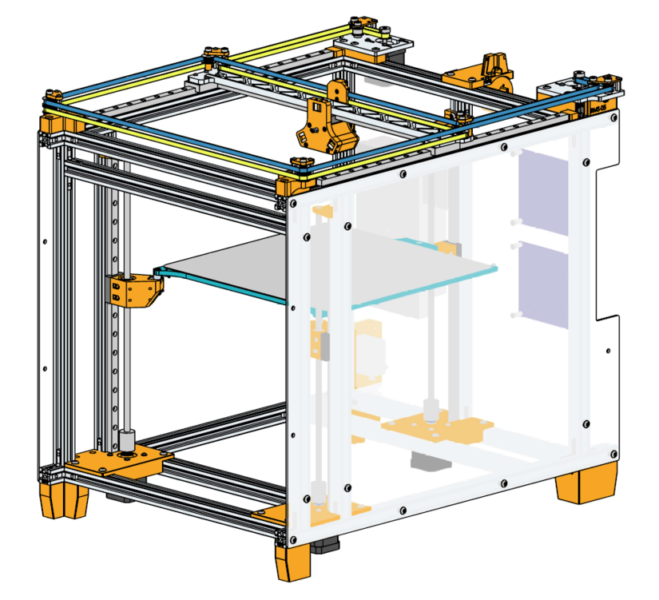                   | 1(+4) | A versatile, open-source toolchanger with a large community of users and developers which is used for both general 3D printing and [scientific applications](https://dx.doi.org/10.1039/D3DD00033H). One nearing completion. Four more planned. | [](http://www.youtube.com/watch?v=I_TUBX-A1sQ) |
| [Delta Stage Microscope](https://openflexure.org/projects/deltastage/)                                                                                                                                                                                                        | 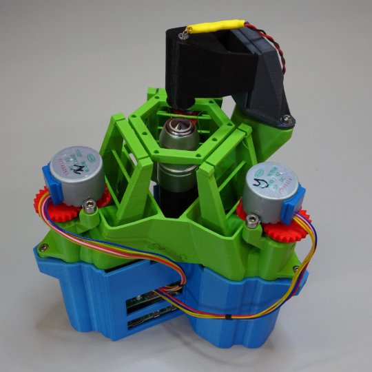               | 2     | A DIY open-source microscope with a fine-positioning, motorized stage. Reflection illumination version of Delta Stage                                                                                                                           |                                                                                                                                           |
| [Opentrons OT-2](https://opentrons.com/products/robots/ot-2/)                                                                                                                                                                                                                 | 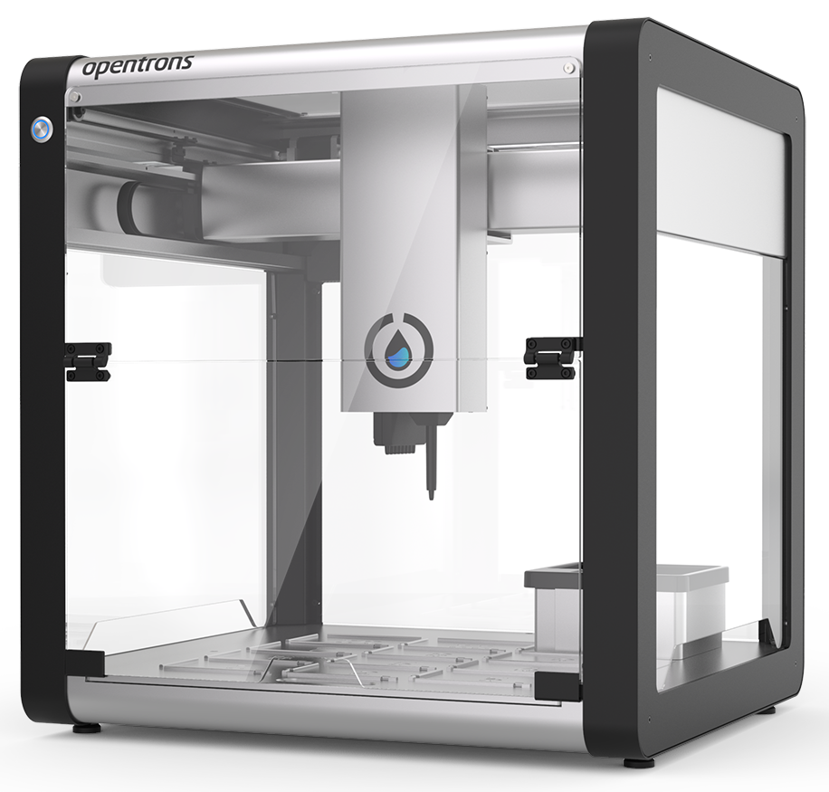                       | 1     | An open-source and cost-friendly commercial liquid handler                                                                                                                                                                                      |                                                                                                                                           |
| [Opentrons Flex](https://opentrons.com/products/flex/)                                                                                                                                                                                                                        | 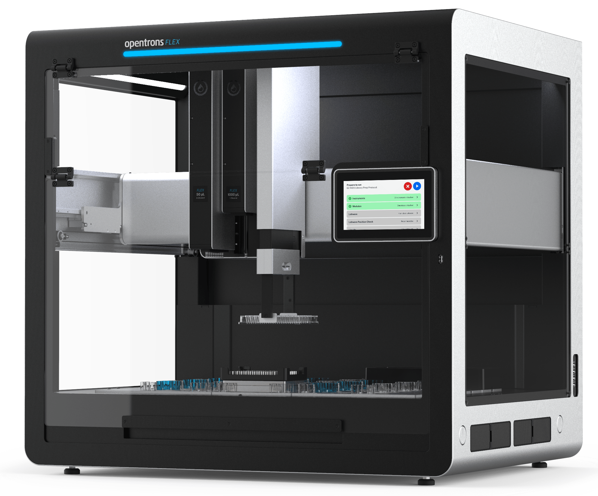            | 1     | An open-source commercial liquid handler tailored towards high-throughput and advanced liquid handling operations                                                                                                                               |                                                                                                                                           |
| [Hiwonder ArmPi FPV](https://www.hiwonder.com/products/armpi?_pos=4&_sid=a9741a308&_ss=r)                                                                                                                                                                                     | 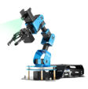                 | 1     | An educational six-axis robotic arm                                                                                                                                                                                                             |                                                                                                                                           |
| [Hiwonder JetAuto Pro](https://www.hiwonder.com/products/jetauto-pro?variant=40040875229271)                                                                                                                                                                                  | 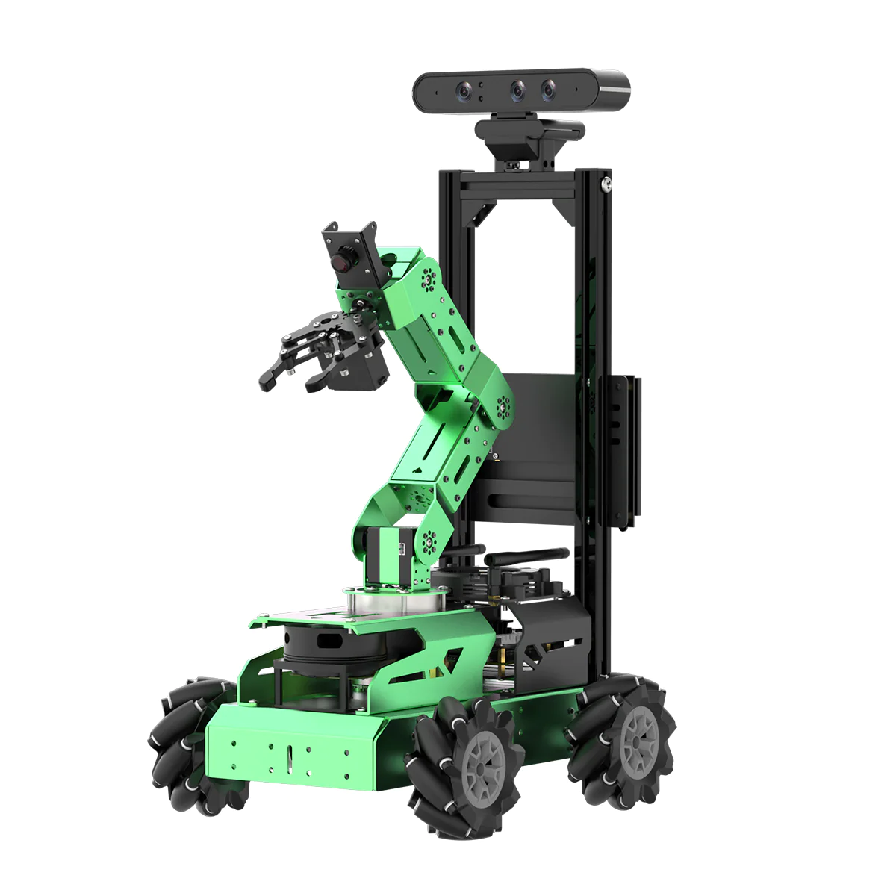               | 1     | An educational six-axis mobile cobot with a 3D depth camera and lidar                                                                                                                                                                           |                                                                                                                                           |
| [MyCobot 280](https://shop.elephantrobotics.com/en-ca/collections/mycobot/products/mycobot-pi-worlds-smallest-and-lightest-six-axis-collaborative-robot) and [MyAGV](https://shop.elephantrobotics.com/en-ca/collections/myagv/products/myagv-2023-pi?variant=47262714069304) |            | 1     | An educational six-axis mobile cobot                                                                                                                                                                                                            |                                                                                                                                           |
| [AutoTrickler v4](https://autotrickler.com/pages/autotrickler-v4)                                                                                                                                                                                                             | 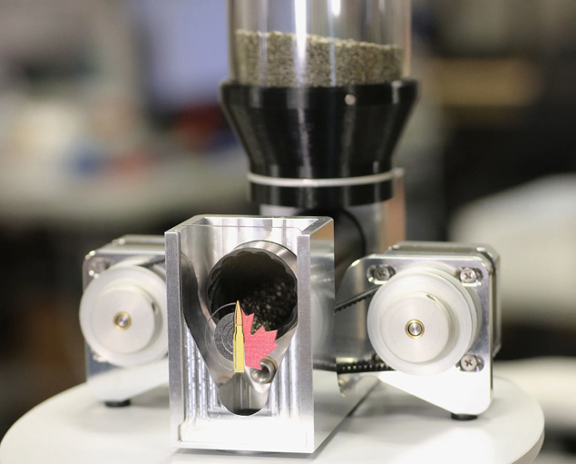           | 1     | An automated solid dispensing station, usually marketed for ammunition reloading, but to be used as a general-purpose powder doser                                                                                                              |                                                                                                                                           |
| [ChargeMaster Supreme](https://www.rcbs.com/priming-and-powder-charging/powder-dispensers-and-scales/chargemaster-supreme-electronic-powder-dispenser/16-98943.html)                                                                                                          | 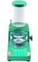 | 1     | An automated solid dispensing station, usually marketed for ammunition reloading, but to be used as a general-purpose powder doser                                                                                                              |                                                                                                                                           |
| [Ingenuity Powder System](https://ingenuityprecision.com/product/ingenuity-powder-system/)                                                                                                                                                                                    | 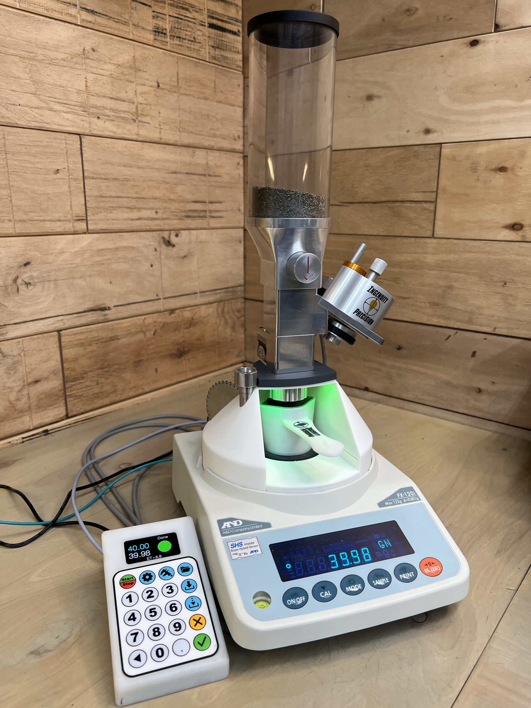   | 1     | An automated solid dispensing station, usually marketed for ammunition reloading, but to be used as a general-purpose powder doser                                                                                                              |                                                                                                                                           |
| [MT Powder Powder Doser](https://www.mt.com/in/en/home/products/Laboratory_Weighing_Solutions/analytical-balances/XPR105-30355389.html)                                                                                                                                       | 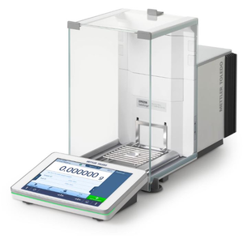                    | 1     | XPR105DU is a commercial, automated powder doser by Mettler-Toledo                                                                                                                                                                              |                                                                                                                                           |
| [Cocoa Press](https://cocoapress.com/en-ca)                                                                                                                                                                                                                                   | 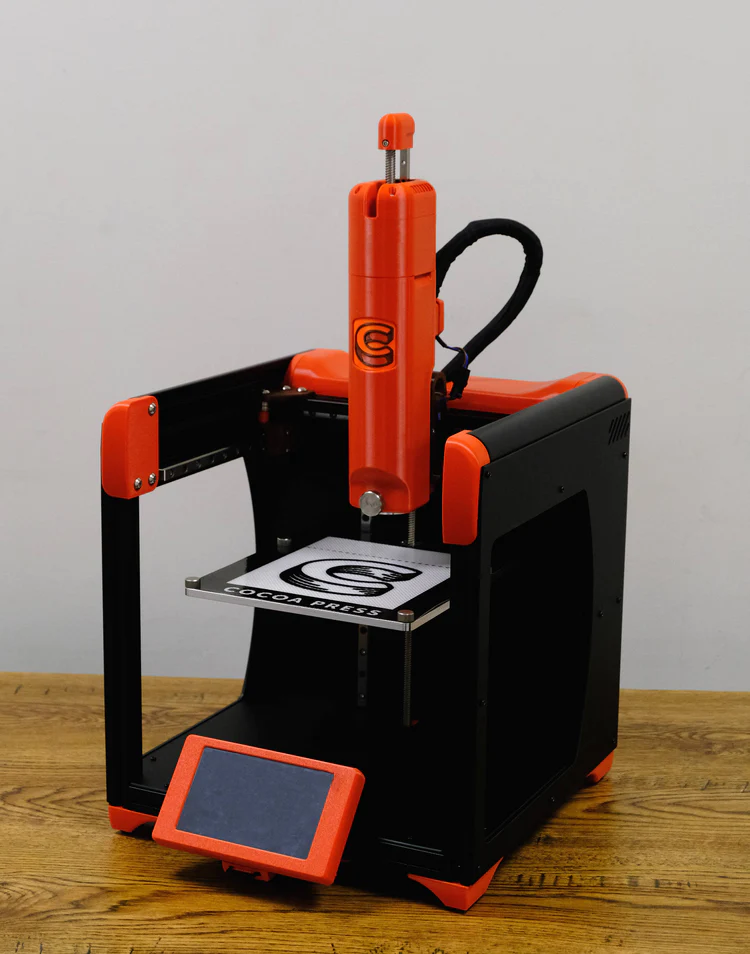               | 1     | A commercially sold and mostly open-source chocolate 3D printer kit                                                                                                                                                                             |                                                                                                                                           |
| [FormAuto](https://formlabs.com/3d-printers/form-auto/) and [Form 3+](https://formlabs.com/3d-printers/form-3/)                                                                                                                                                               | 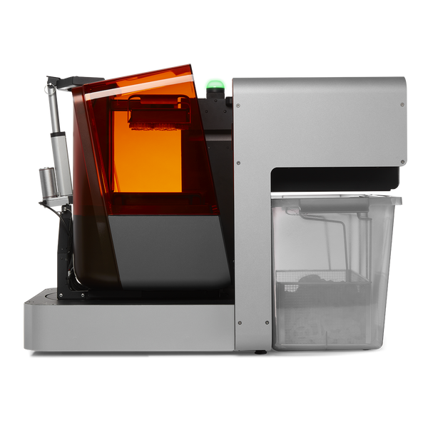           | 1     | 24/7 autonomous SLA 3D printer with camera inspection                                                                                                                                                                                           | [](https://www.youtube.com/shorts/9ojPpwQMfrM)   |
| [Form 3L](https://formlabs.com/3d-printers/form-3l/) package                                                                                                                                                                                                                  | 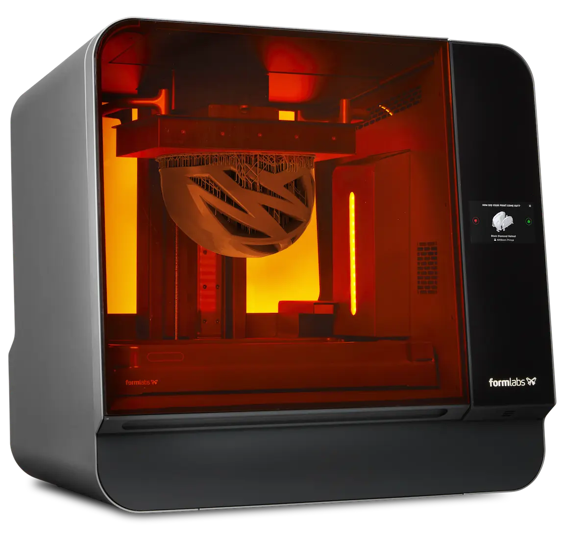                  | 1     | A large-format SLA printer with wash and cure stations                                                                                                                                                                                          |                                                                                                                                           |
| [Bambu Lab X1E with AMS](https://bambulab.com/en/x1e)                                                                                                                                                                                                                         | 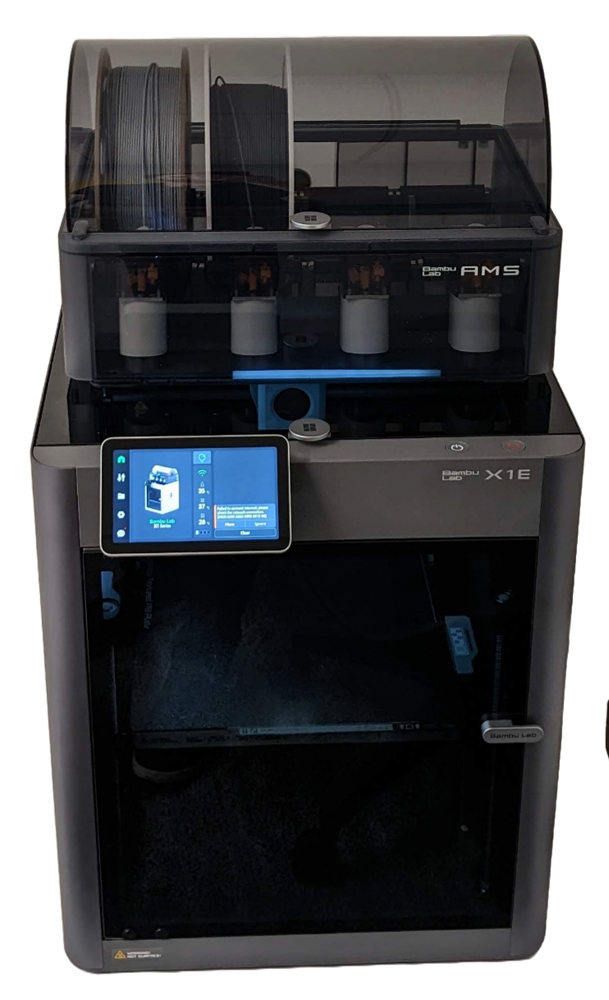             | 1     | A high-performance multi-color FDM 3D printer with air filtration, chamber heating, and WPA2-Enterprise WiFi support.                                                                                                                           | [](http://www.youtube.com/watch?v=U_jJQKIOzTg)         |
| [Automated Turntable](https://www.tindie.com/products/fluxgarage/turntable-for-stepper-motor-kit/)                                                                                                                                                                            |       | 1     | An open-source automated turntable controlled by a stepper motor and designed for photography applications                                                                                                                                      |                                                                                                                                           |
| [Digital Pipette](https://github.com/ac-rad/digital-pipette)                                                                                                                                                                                                                  | 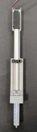           | 1     | A DIY linear actuator-based syringe pump designed for easy handling by robotic arms                                                                                                                                                             | [](https://www.youtube.com/shorts/s2cVo1ZFzKc)   |
| [Chi.Bio](https://chi.bio/)                                                                                                                                                                                                                                                   | 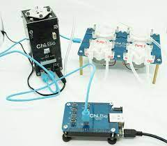                  | 1     | A commercially sold, open-source automated system with heating, stirring, liquid handling, spectrometry, and optogenetics characterization geared towards biological research                                                                   |                                                                                                                                           |
| [Pioreactor](https://pioreactor.com/en-ca/products/pioreactor-20ml?variant=46559156469816)                                                                                                                                                                                    | 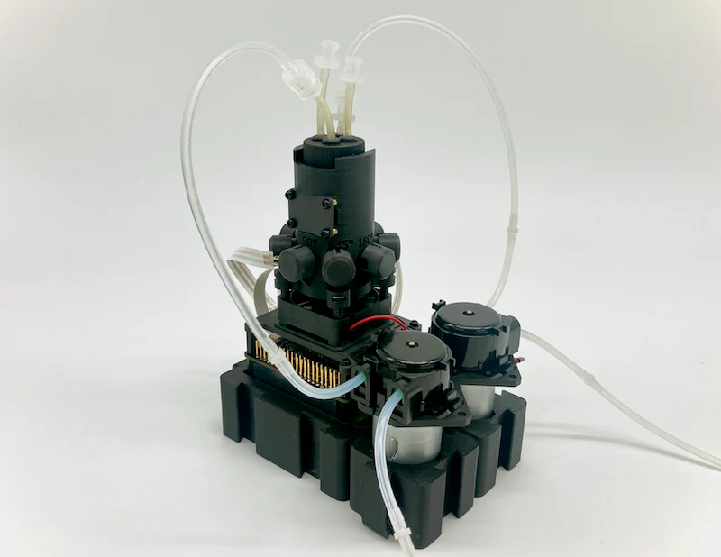               | 2     | A commercially sold, open-source automated bioreactor with heating, stirring, and optical density measurements                                                                                                                                  |                                                                                                                                           |
| [Rodeostat](https://iorodeo.com/products/rodeostat)                                                                                                                                                                                                                           | 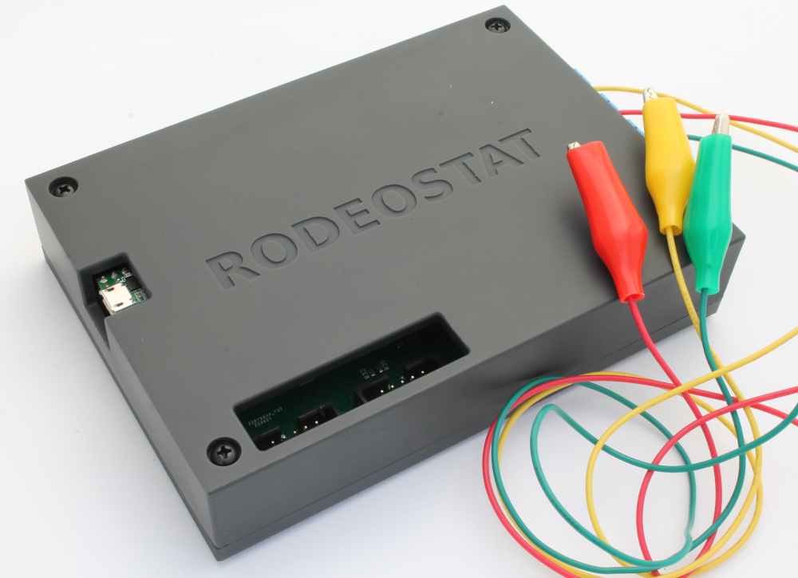                 | 5     | A commercially sold, open-source potentiostat for electrochemical experiments with current measurement ranges of +/- 0.001, 0.01, 0.1, 1mA.                                                                                                     |                                                                                                                                           |
| [Rodeostat HC](https://iorodeo.com/products/rodeostat-hc)                                                                                                                                                                                                                     |                  | 1     | A commercially sold, open-source potentiostat for electrochemical experiments with current measurement ranges of +/- 0.01, 0.1, 1, 10mA.                                                                                                        |                                                                                                                                           |
| [Squidstat Solo](https://www.admiralinstruments.com/product-page/squidstat-solo)                                                                                                                                                                                              | 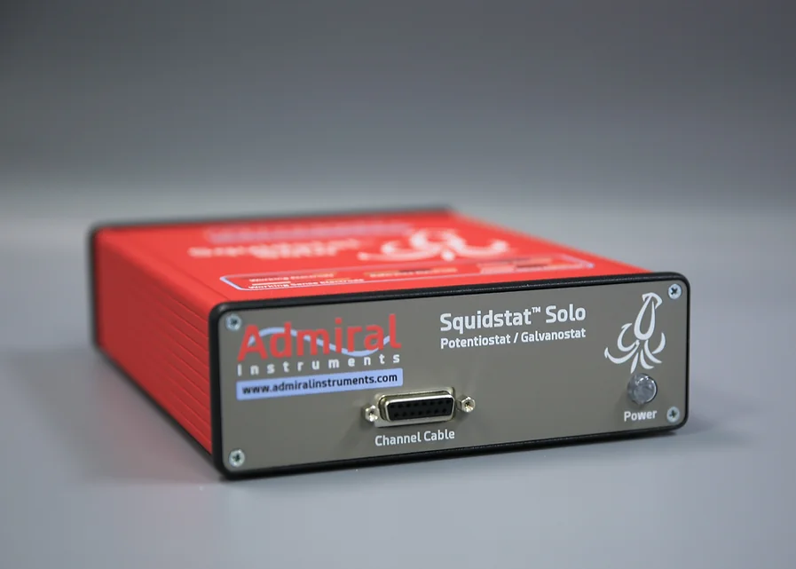                 | 1     | An entry-level research-grade potentiostat with eight ranges between +/- 10 nA and +/- 100 mA and a Python API                                                                                                                                  |                                                                                                                                           |
| [Microfluidics](https://www.labmaker.org/collections/biotechnology/products/pressure-regulator-senyo-lab)                                                                                                                                                                     | 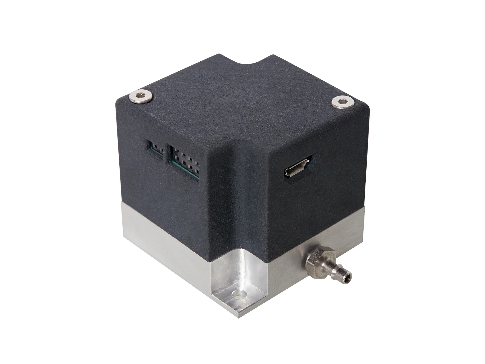          | 1     | A commercially sold, open-source pressure regulator for controlling pneumatically-driven microfluidic chips                                                                                                                                     |                                                                                                                                           |
| [UC2 Minibox](https://www.labmaker.org/collections/uc2-miniscope/products/uc2-minibox)                                                                                                                                                                                        | 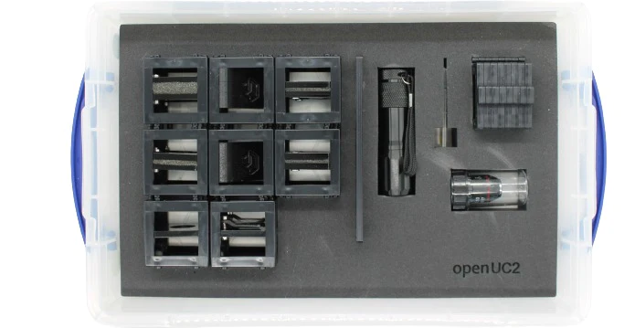              | 1     | A commercially sold, open source set of introductory modular optics cubes for microscopy                                                                                                                                                        |                                                                                                                                           |
| [Vial Capper](https://ca.robotshop.com/products/dh-robotics-automated-screw-cap-decapper-intelligent-capping-machine)                                                                                                                                                         | 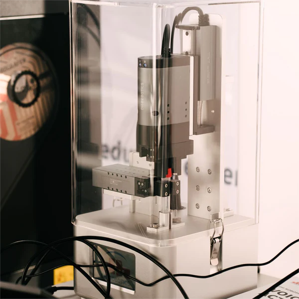          | 1     | An automated vial capping and decapping machine by DH-Robotics                                                                                                                                                                                  | [](http://www.youtube.com/watch?v=S3lx9qviH9Y) |

<!-- <a href="http://www.youtube.com/watch?v=S3lx9qviH9Y" title="Introduction to Robotics"></a> -->

<!-- NOTE: Video thumbnails like {h=50px align=center target="http://www.youtube.com/watch?v=I_TUBX-A1sQ"} use myst syntax https://myst-parser.readthedocs.io/en/latest/syntax/images_and_figures.html, but the <a href="">...</a> gets ignored. So, I have the wonky workaround of using [](http://www.youtube.com/watch?v=S3lx9qviH9Y) -->

<!-- <a href="http://www.youtube.com/watch?v=VIDEO_ID" title="TITLE"></a> -->

<!--- | Mobile manipulator (e.g., uMobileLab) | 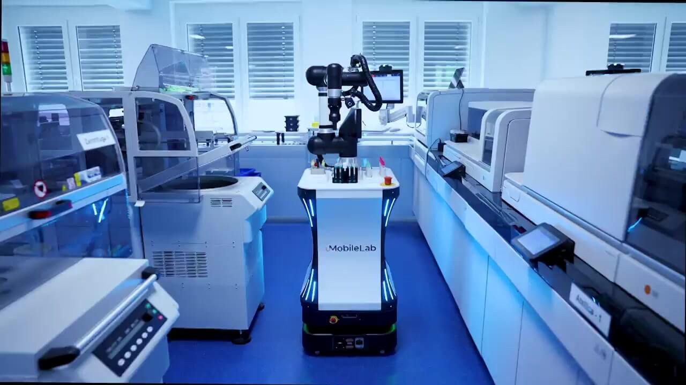 | 1 | A research-grade six-axis mobile cobot with vision capabilities optimized for laboratory environments |

| Desktop SEM (e.g., Phenom) | 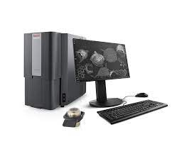 | 1 | A desktop scanning electron microscope (SEM) with Python integrations |

--->

| Name                     | Image | Qty | Description                                                                                                                                                                                                                                                                                                                                                                            |
| ------------------------ | ----- | --- | -------------------------------------------------------------------------------------------------------------------------------------------------------------------------------------------------------------------------------------------------------------------------------------------------------------------------------------------------------------------------------------- |
| Mobile manipulator       |       | 1   | A research-grade six-axis mobile cobot with vision capabilities optimized for laboratory environments                                                                                                                                                                                                                                                                                  |
| Desktop SEM              |       | 1   | A desktop scanning electron microscope (SEM) with Python integrations                                                                                                                                                                                                                                                                                                                  |
| Chamber interfaces (TBD) |       | -   | e.g., miniature glovebox, miniature ductless fumehood, small nitrogen generator                                                                                                                                                                                                                                                                                                        |
| Low-force tensile tester |       | 1   | Low-cost, open-source tensile tester. Examples [[1](https://www.instructables.com/Universal-Tensile-Testing-Machine-VERSION-TWO/)], [[2](https://www.creativemachineslab.com/freeloader.html)], [[3](https://tspace.library.utoronto.ca/bitstream/1807/109212/4/Liu_Xinyue_202111_MAS_thesis.pdf)], [[4](https://www.printables.com/model/81214-open-pull-diy-universal-test-machine)] |

## Workflows

The AC Training Lab is intended as a hands-on sandbox and prototyping environment for researchers. Each workflow will either be dedicated (permanent) or supported (non-permanent).

### Dedicated Workflows

While the equipment is not restricted to particular workflows, we are actively developing a subset of readily accessible workflows for the AC Training Lab. Note that single workflow could be carried out using different sets of equipment within the training lab. These workflows will use dedicated hardware in a permanent setup to allow for 24/7 access. The core workflows that are planned, in development, or available are listed below:

| Name                                                                                | Diagram                                                  | Description                                                                                                                                                | Status      |
| ----------------------------------------------------------------------------------- | -------------------------------------------------------- | ---------------------------------------------------------------------------------------------------------------------------------------------------------- | ----------- |
| Light-based color matching                                                          |   | Adjust red, green, and blue LED power levels to match a target color                                                                                       | Ready       |
| Liquid-based color matching                                                         |  | Adjust diluted red, yellow, and blue food coloring pumping power to match a target color                                                                   | Ready       |
| Solid-based color matching                                                          |   | Adjust the composition of red, yellow, and blue powder (e.g., wax) and processing conditions to match a target color                                       | Development |
| Chocolate tensile testing                                                           |                                                          | Adjust the composition and processing conditions of 3D printed chocolate tensile specimens to tune the microstructure for maximization of tensile strength | Development |
| [Yeast growth](https://docs.pioreactor.com/experiments/yeast-growth-by-temperature) |                                                          | Adjust reactor temperature to maximize yeast growth and explore nonlinear effects                                                                          | Development |
| Titration                                                                           |                                                          | Add a base of known concentration to an acid to find the equivalence point as determined by successive pH measurements                                     | Development |
| Conductivity                                                                        |                                                          | Adjust the ratio of battery electrolyte reagants to maximize conductivity and redox potential for a target pH                                              | Planning    |
| Polymer cross-linkage                                                               |                                                          |                                                                                                                                                            | Planning    |


### Supported Workflows

Supported workflows (i.e., non-permanent setups) that are planned, in development, or available are listed below:

| Name                                 | Diagram | Description                                                                                                                         | Status      |
| ------------------------------------ | ------- | ----------------------------------------------------------------------------------------------------------------------------------- | ----------- |
| Alkaline Catalysis Lifecycle Testing |         | Adjust the stress-cycling conditions of a nickel electrode in a KOH solution to investigate the cause of catalyst degredation       | Ready       |
| Material recycling                   |         | Incorporate the use of "waste" experimental samples as part of a recycling workflow using mixed red, yellow, and blue solid powders | Development |


## Functionality

This refers to the infrastructure-focused capabilities showcased in the AC Training Lab. The core functionalities (intended as permanent demos) that are planned, development, or available are listed below. These functionalities may either be standalone or part of the workflows listed above.

| Name                       | Diagram | Description                           | Status      |
| -------------------------- | ------- | ------------------------------------- | ----------- |
| Vial transfer (stationary) |         | Move a vial between adjacent modules  | Ready       |
| Vial transfer (mobile)     |         | Move a sample to a different location | Development |
| Vial capping/decapping     |         | Cap or decap a vial                   | Development |
| Tool changing              |         | Swap a tool on a robotic arm          | Development |

## Feedback

We would love to get suggestions on the [types of workflows and functions](https://github.com/AccelerationConsortium/ac-training-lab/discussions/3) you'd like to see in the AC Training Lab! For additional training opportunities offered by the Acceleration Consortium, please navigate to [AC Microcourses](https://ac-microcourses.readthedocs.io/en/latest/).

## Contents

```{toctree}
:maxdepth: 2
:includehidden:

Setting Up IoLT Devices <devices/setup_iolt_devices>
Tailscale Setup <tailscale-setup>
Raspberry Pi WiFi Setup <raspberry-pi-wpa2-enterprise>
Internet Connectivity & Uptime Tracking <connectivity-uptime-tracking>
Devices <devices/index>
Developer Resources <dev-resources>
```

## Indices and tables

* {ref}`genindex`
* {ref}`modindex`
* {ref}`search`

[Sphinx]: http://www.sphinx-doc.org/
[Markdown]: https://daringfireball.net/projects/markdown/
[reStructuredText]: http://www.sphinx-doc.org/en/master/usage/restructuredtext/basics.html
[MyST]: https://myst-parser.readthedocs.io/en/latest/

<script async defer src="https://buttons.github.io/buttons.js"></script>
