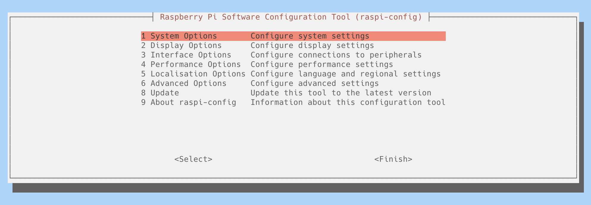
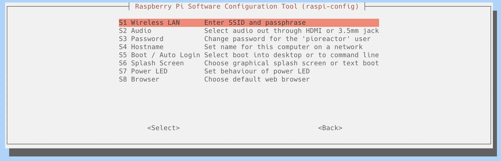
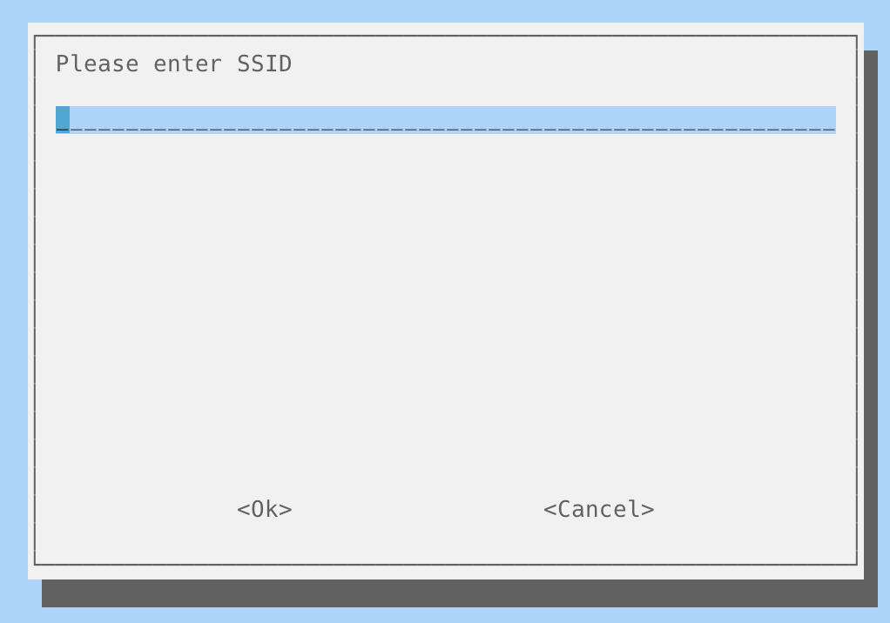
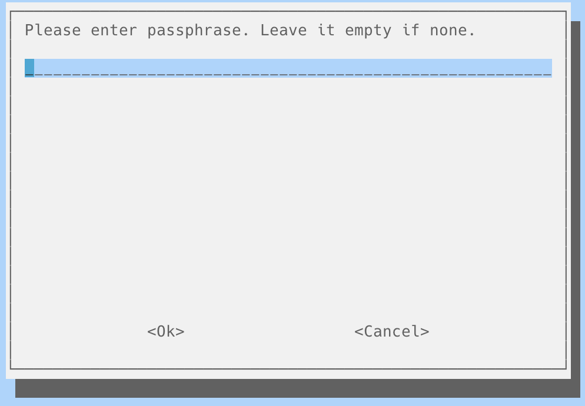

# How to change wifi

### 1. SSH into the Pioreactor
```
ssh pioreactor@<ip_address>
```

### 2. Change the wifi settings
Run:
```
sudo raspi-config
```
Then navigate to:
- **System Options**


- **Wireless LAN**


### 3. Enter the new SSID and passphrase (network name and password)



### 4. Power cycle the Pioreactor

### 5. Connect to new wifi and find the IP address
After changing the wifi settings, the Pioreactor will be disconnected from the current wifi network and will attempt to connect to the new one.


# Recommendations when traveling with the Pioreactor
Setup the SSID and password of your mobile hotspot to be the same as your original wifi. This way, the Pioreactor will automatically connect to your mobile hotspot when you are traveling.
